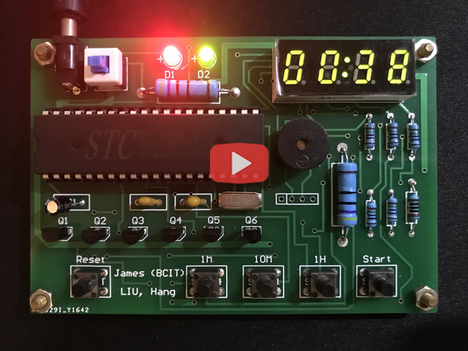
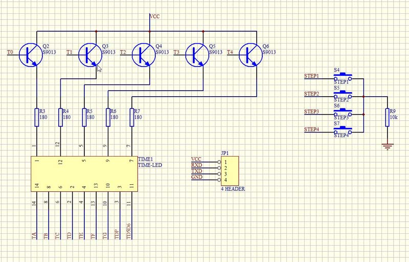
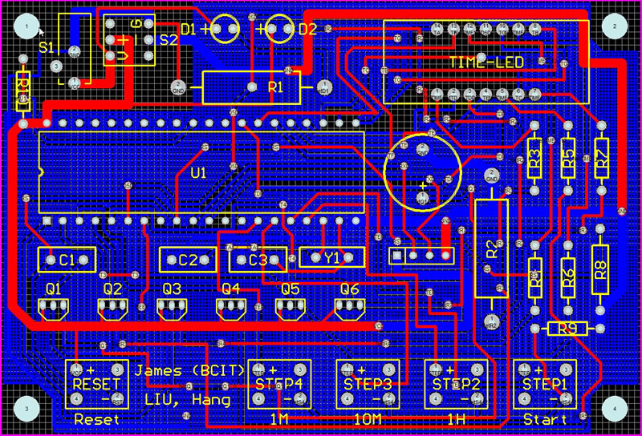

# Introduction
This is a simple timer hardware based on STC89C52RC MCU, and you could watch this video to know more about it: https://youtu.be/WQ8nN4hAElQ

## Development Environment
* **IDE For Source Code**: *Keil μVision V3.30*
* **Design Tool for PCB**: *Protel 99 SE*

## Compile
1. Open `src/Timer.Uv2` with Keil
2. Click `Project` on the main menu and then click `Rebuild All Target Files`;
3. You will get a `Timer.hex` in the src directory;
4. Download the `Timer.hex` to the Timer Device with a downloader, such as a downloader based on CH341 chip.

## Previews
### Timer Hardware

### Schematic Design

### PCB Layout
